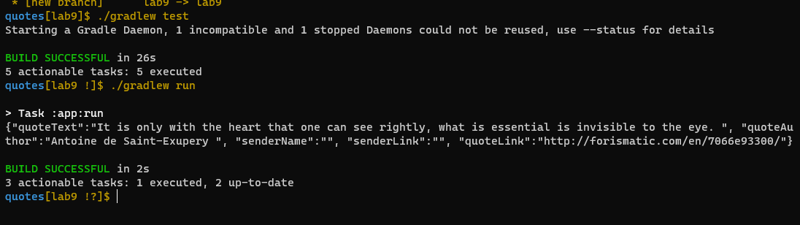

# quotes

## lab 8
This application responsible to take a json file that has an array of objects inside it and convert its content to objects then pick one object randomly and return the author and the text of the quotes from it

### install dependencies and run the app

* For dependencies add this line into Dependencies part in `build.gradle` file 👇

`implementation 'com.google.code.gson:gson:2.8.8'`

* when we run the App, we should see one random quote and its author in the screen.

* To test my code I ran `./gradlew test` on my terminal

## lab 9
In this lab I've added new feature that make the app send a request to an api and get request to show the random quote and add it to json file named `NewQuotes`, for use if the app goes offline in the future
**If the status of the request fail the app will provide a random quote from static json file**

### install dependencies and run the app

* For dependencies add this line into Dependencies part in `build.gradle` file 👇

`implementation 'com.google.code.gson:gson:2.8.8'`

* when we run the App, we should see one random quote and its author in the screen.

* To test my code I ran `./gradlew test` and `./gradlew run` on my terminal

